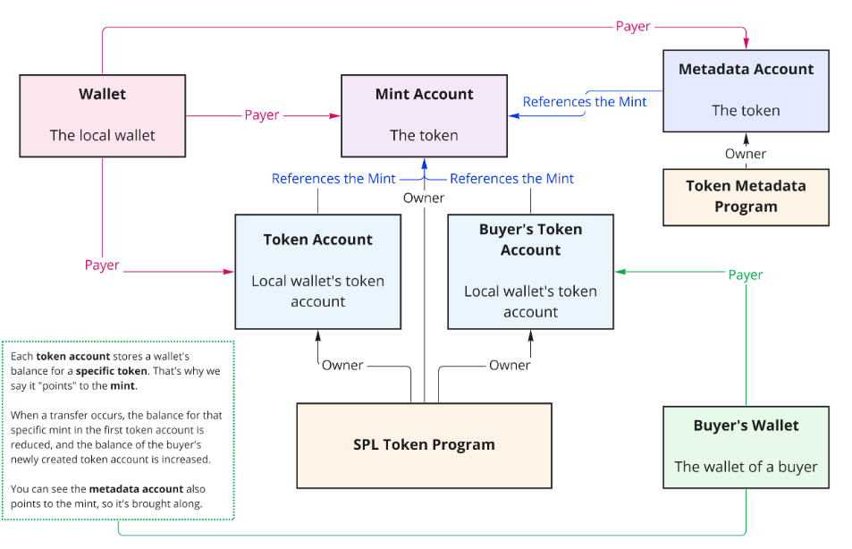

# SOLANA NFT DEMO


I use Anchor framework in this demo to make the nft smart contract and metaplex for NFT metadata handling which is the trusted standard for NFTs and digital assets on Solana.

| Functions        | Description                                                |
| ------------------ | ---------------------------------------------------------- |
|| 
| `mint-nft` | Mint an NFT to your local wallet using **Anchor**, including metadata using **Metaplex**. |
| `sell-nft` | Sell one of your NFTs to another Solana wallet. Receive SOl from & transfer NFT to buyer. |

## How NFTs Work



## Installation

Setup Solana

```bash
sh -c "$(curl -sSfL https://release.solana.com/stable/install)"
```
Add anchor using cargo
```bash
cargo install --git https://github.com/coral-xyz/anchor avm --locked --force
```
Create project
```bash
anchor init solana-nft-demo
```
Packages to add while making contract

```bash
cargo add anchor-lang@0.28.0 --features=init-if-needed
cargo add anchor-spl@0.28.0 --features=metadata
cargo mpl-token-metadata@1.13.2

```

## Deployment
Run the solana validator on local in separate terminal
```bash
solana-test-validator
```
Build the project
```bash
anchor build
```

 Deploy the project
```bash
anchor deploy
```


